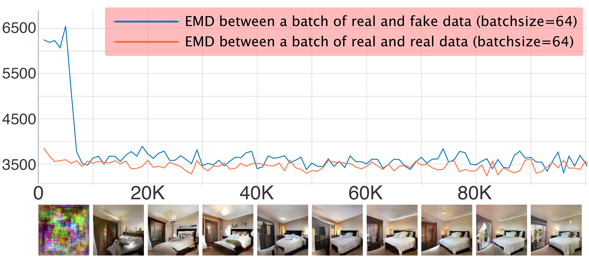

# SoftGAN -- Official PyTorch implementation


In this paper, we propose Soft Generative Adversarial Networks (SoftGAN), a strategy that utilizes a dynamic borderline softening mechanism to train Generative Adversarial Networks. 
This mechanism aims to solve mode collapse problem and enhance the training stability of the generated outputs.
Within SoftGAN, the objective of discriminator is to learn a fuzzy concept of real data with a soft borderline between real and generated data. This objective is achieved by balancing the principles of maximum concept coverage and maximum expected entropy of fuzzy concepts.
During the early training stage of SoftGAN, the principle of maximum expected entropy of fuzzy concepts guides the learning process due to the significant divergence between the generated and real data. 
However, in the final stage of training, the principle of maximum concept coverage dominates as the divergence between the two distributions decreases.
The dynamic borderline softening mechanism of SoftGAN can be likened to a student (the generator) striving to create realistic images, with the tutor (the discriminator) dynamically guiding the student towards the right direction and motivating effective learning.
The tutor gives appropriate encouragement or requirements according to abilities of the student at different stages, so as to promote student to improve themselves better.
Our approach offers both theoretical and practical benefits for improving GAN training. 
We empirically demonstrate the superiority of our SoftGAN approach in addressing mode collapse issues and generating high-quality outputs compared to existing approaches.



## metrics: FID

Linear convolutional GAN architectures:

 Models                            | CIFAR-10             |      STL-10          | CelebA         
-----------------------------------------|------------------:|----------------:|---------------:
 Dropout-GAN                             | 88.6             |                | 36.36         
 DCGAN                                   | 37.7             |                
 DCGAN+TTUR                              | 36.9             |                
 WGAN-GP                                 | 29.3             | 55.1           
 SNGAN (linear G + linear D)       | 29.3             | 53.1           
 MGAN                                    | 26.7             |                
 SoftGAN (linear G + linear D)  | **21.34**            | **51.67**          | **10.33**  
 
 ResNet convolutional GAN architectures:
 
 Models                            | CIFAR-10             |      STL-10          | CelebA         
-----------------------------------------|------------------:|----------------:|---------------:
 WGAN-GP+TTUR                            | 24.8             |                
 SNGAN (ResNet G + skip D)         | 21.7             | 40.1           
 PeerGAN                                 | 21.55            | 51.37          | 13.95         
 BigGAN                                  | 14.73            |                
 Autogan                                 | 12.42   | 31.01          |               
 SoftGAN (ResNet G + skip D)    | **12.50**            | **30.87** | **6.65** 
 
 Style convolutional GAN architectures:
 
 Models                            | CIFAR-10             |      STL-10          | CelebA         
-----------------------------------------|------------------:|----------------:|---------------:
 StyleGAN2                               | 11.07            |                | 5.06          
 LT-GAN                                  | 9.80             | 31.35          | 16.84         
 SoftGAN (style G + linear D)   | **3.07**   | **23.92** | **2.79** 

## metrics: IS on CIFAR-10
Models    | Score 
-----------------------------------------|------------------:
WGAN-GP (small CNN)	| 2.98 ± 0.11
CT-GAN (small CNN) | 5.12 ± 0.12
ALI | 5.34 ± 0.05
BEGAN  | 5.62 
DCGAN | 6.16 ± 0.07 
Improved GAN  | 6.86 ± 0.06 
PeerGAN  | 7.45
DFM  | 7.72 ± 0.13
WGAN-GP (ResNet)  | 7.86 ± 0.07
CT-GAN (ResNet)  | 8.12 ± 0.12
SNGAN  | 8.22 ± 0.05
MGAN  | 8.33 ± 0.10 
CR-GAN (ResNet)  | 8.40
DCD (ResNet)  | 8.54
SoftGAN (small CNN) | 6.46 ± 0.42
SoftGAN (ResNet) | 8.55 ± 0.05


## Code Description

Here we provide a demo of SoftGAN code under the toy_2D dataset, with the network architecture using DCGAN.
This demo is mainly used to demonstrate the effectiveness of the dynamic borderline softening mechanism in SoftGAN.
We also provide the implementation codes of FID and IS, two quantitative indicators involved in our paper.

## Citation

```
coming soon…
```